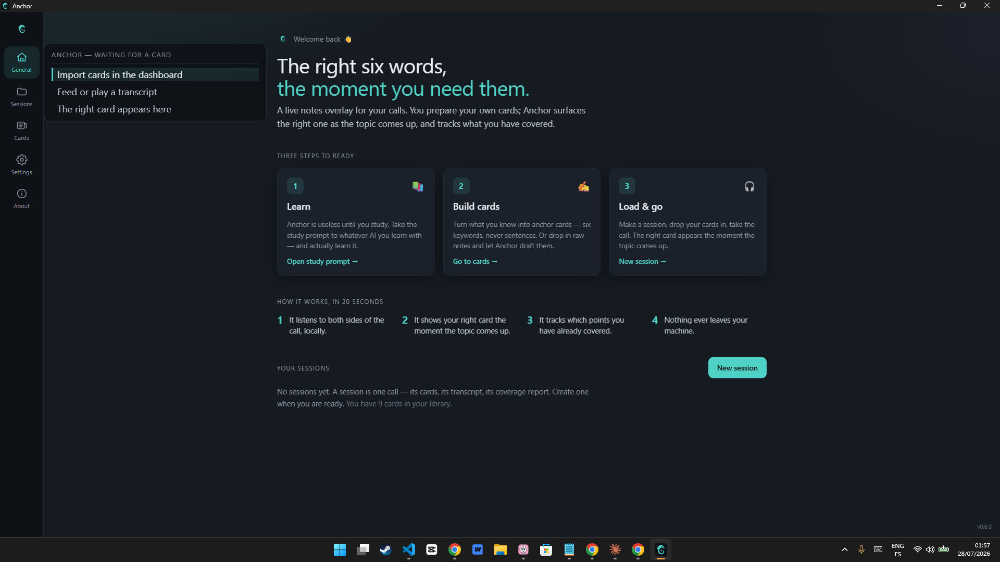

<div align="center">

# ⚓ Anchor

### Prepared, not prompted.

A live notes overlay for online calls. You prepare your own cards; Anchor puts the right one in front of you the moment the topic comes up — and tracks which points you've already made.

**No stealth mode · No answers to read aloud · Nothing leaves your machine.**
It is useless until you've done the work. That is the point.

[](LICENSE)
&nbsp;
&nbsp;
&nbsp;



</div>

---

## The problem

You know the material. Under pressure, the **name** won't come — the term, the number, the project. Your notes are forty pages; finding the right one live is impossible; your eyes go hunting and you present worse than you are.

Anchor's one job: **the right six keywords, large, in front of your eyes, the moment you need them — reacting from the first words spoken, yours or theirs.**

## Who it's for

| For | The call |
|-----|----------|
| 💼 **Client calls** | Your product, your pricing, your terms |
| 👥 **Team calls & reviews** | Architecture reviews, standups, presenting to your boss |
| 📈 **Investor & founder chats** | Numbers and story, straight |
| 🎤 **Interviews** | Either side of the table — candidate or interviewer |
| 🗣️ **Any online meeting** | …where you know the material but names escape you |

It leads with the general case on purpose — interviews are one use, not the identity.

## What's inside

Everything runs **on your machine**. No account, no cloud, no telemetry.

| | Feature |
|---|---------|
| 🎧 | **Dual-channel local capture** — your mic is *you*, system audio is *them*; speaker identity is true by construction, and it works with headphones |
| 🈺 | **Multilingual speech-to-text** — English, Spanish, Russian, Ukrainian, German, streaming and on-device; pick the model that fits your machine |
| 🧲 | **Semantic + keyword retrieval** — the right card jumps as the topic emerges, driven by what the *other side* raises; the keyword leg catches the proper nouns and numbers that escape under pressure |
| ✅ | **Bullet-level coverage** — each point is an independent hit/miss flag, out-of-order tolerant; a post-call report turns the misses into your next study list |
| ✨ | **Assembly for the unexpected question** — a card built live from *your own material* (free local model or your own API key); anything beyond your material is labelled, never faked |
| 🔇 | **Acoustic echo cancellation** — on open speakers, the other side's voice is stripped from your mic before it's transcribed |
| 🪟 | **A calm overlay** — one card, large type, under your webcam, click-through, optional screen-share exclusion (off by default) and a *Show notes* button — there is no stealth |
| 🔒 | **Local-first storage** — one SQLite file, text only; audio is never written to disk |

## How it works

1. **You study.** Anchor ships a study prompt ([prompts/1_LEARN.md](prompts/1_LEARN.md)). Take it to whatever AI you learn with and actually learn the material — Anchor won't do this for you.
2. **You build cards.** Six keywords per card, not sentences ([prompts/2_BUILD_CARDS.md](prompts/2_BUILD_CARDS.md)). Write prose and Anchor warns you — a script fails you under pressure.
3. **You take the call** ([prompts/3_LOAD.md](prompts/3_LOAD.md)). Anchor listens to both sides locally, jumps to the right card, highlights the next point you haven't covered, and assembles a labelled card for anything you didn't prepare.
4. **You review.** Full transcript (text only) and a coverage report — which points you hit, which you missed. The misses feed the next round of prep.

## What it is not

- ❌ It does **not** write sentences for you to read aloud. Keywords only, and machine-built bullets are always visibly marked.
- ❌ No stealth mode, no "undetectable" mode, no process disguise.
- ❌ It does **not** send your notes or audio anywhere. The only network calls are the optional bring-your-own-key LLM step and the page fetch you explicitly ask for.
- ❌ It is **not** a substitute for knowing your subject.

## How it differs from things that look similar

| Tool | What it does | Anchor |
|------|--------------|--------|
| Talking-point trackers | Check off one linear outline for a solo speaker | Navigates a corpus of many cards by what the **other side** raises, on a two-sided call |
| Meeting-agenda tools | Tick a flat shared agenda in the cloud | Tracks bullet-level coverage of **your own** material, locally |
| Sales "battle cards" | Fire on keywords, push the vendor's playbook | Matches **meaning**, surfaces only what **you** wrote |
| Interview "copilots" | Generate answers and hide from capture | Does neither — this repo is something you can show the person across the table |

## Languages & models

Nothing is bundled; models download on first run (with an integrity check) and cache offline. Details in [docs/models.md](docs/models.md) and [THIRD_PARTY.md](THIRD_PARTY.md).

| Speech model | Languages | Best for |
|--------------|-----------|----------|
| **Automatic** (default) | EN · ES · RU · UK · DE | Almost everyone |
| **English — fastest** | EN | English-only calls |
| **Compatibility (offline)** | 25 European languages | Slower computers |

Retrieval is cross-lingual by design — English cards match Russian, Spanish, Ukrainian, or German speech.

## Build from source

Windows 11, with Rust (`msvc`), Node + **pnpm**, and the C++ / CMake / Ninja / LLVM toolchain (the embedded llama.cpp and speexdsp build from source). Full prerequisites are in [CONTRIBUTING.md](CONTRIBUTING.md).

```bash
pnpm install
pnpm tauri dev
```

## Documentation

- 📐 [Architecture](docs/architecture.md) — how the capture → recognition → match → overlay pipeline works
- 🧠 [Models](docs/models.md) — the on-device speech, retrieval, and assembly models
- 🔒 [Security & privacy](SECURITY.md) — what stays local, and the only three network egress points
- 🤝 [Contributing](CONTRIBUTING.md) — build from source and the review gate

## Roadmap

Not a patch list — the direction, in version jumps.

| Milestone | The big move |
|-----------|--------------|
| **Now · pre-alpha** | The full local pipeline works on Windows: dual capture, multilingual streaming + offline speech, hybrid retrieval, coverage, live assembly, echo cancellation |
| **→ v1.0 · first release** | One-click model downloader, a signed installer, published benchmark numbers, an accessibility pass — a stranger installs it and is useful in three steps |
| **v1.x · reach** | macOS (ScreenCaptureKit capture), more languages, sharper on-device accuracy |
| **v2.0 · teams & mobility** | Shared team card libraries, a mobile companion for in-person meetings |
| **Someday · deliberately deferred** | Level-3 voice-in-the-earpiece — it changes the product's character, so it waits until the core is unimpeachable |

Have a use case we're missing? [Open an issue](../../issues).

## Contributing

Contributions are welcome — quality and honesty first. Read [CONTRIBUTING.md](CONTRIBUTING.md) and the [Code of Conduct](CODE_OF_CONDUCT.md). Security issues go through [SECURITY.md](SECURITY.md), not a public issue.

## License

[AGPL-3.0](LICENSE). Use it, read it, fork it — but derivatives stay open.

---

<div align="center">

*Anchor does not know anything until you teach it. That is not a limitation. That is the product.*

</div>
